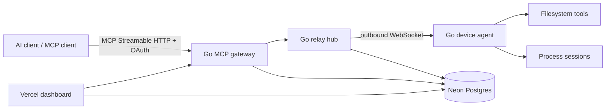

# Open Remote Commander

Open Remote Commander is an open-source remote MCP gateway and device agent written in Go. It lets an MCP-capable AI client invoke filesystem and terminal tools on computers you control without exposing an inbound port on those computers.

> Status: **v0.1 engineering preview**. The Go relay, outbound device agent, pairing flow, device control API, metadata-only audit path, and static dashboard are implemented. Production MCP bearer validation uses standards-based OAuth token introspection. A standards-compliant external authorization server is still required for production OAuth issuance/login; ORC deliberately does not implement a home-grown OAuth server.

## Why this project exists

The useful product shape is simple: an AI client connects to a hosted MCP endpoint; a small foreground agent on your computer opens an outbound connection; calls are routed to that device and executed locally. The cloud service must not become a second shell host or a long-term store of file contents.

## Architecture



The current server uses the official `modelcontextprotocol/go-sdk` and a stateless MCP transport. Device connections are stateful WebSockets; the execution authority remains on the paired machine.

## Implemented MCP tools

- `list_devices`
- `ping`
- `read_file`
- `read_multiple_files`
- `write_file`
- `edit_block`
- `list_directory`
- `create_directory`
- `move_file`
- `get_file_info`
- `start_search`
- `get_more_search_results`
- `stop_search`
- `list_searches`
- `start_process`
- `read_process_output`
- `interact_with_process`
- `force_terminate`
- `list_sessions`
- `list_processes`
- `kill_process` (local policy opt-in)
- `get_config`

The filesystem layer canonicalizes paths and resolves symlinks before enforcing allowed roots. `edit_block` refuses ambiguous replacement counts; search sessions and multi-file reads are bounded. Read/write sizes, relay frames, process buffers, HTTP headers, search results, and process concurrency are all capped. Arbitrary OS-PID termination is disabled unless the local agent explicitly sets `ORC_ALLOW_KILL_PROCESS=true`.

## Security model

Open Remote Commander is privileged automation, not a sandbox. An authorized AI client can do what the local OS user can do through enabled tools. Allowed roots and future command rules are guardrails; use a VM/container for untrusted workloads.

Cloud-side audit records contain metadata such as tool name, device, status, and duration. Tool arguments and results are not persisted by the application schema. Device secrets are stored as SHA-256 token hashes; plaintext tokens are supplied only to the agent.

See [SECURITY.md](SECURITY.md) and [docs/THREAT_MODEL.md](docs/THREAT_MODEL.md).

## Local development

Requires Go 1.25 or newer.

```bash
cp .env.example .env
# Export the values from .env with your preferred env loader.

go run ./cmd/orc-token  # mint a development MCP bearer token

go run ./cmd/orc-server
# in another terminal; the agent starts the pairing flow automatically
go run ./cmd/orc-agent
```

For a memory-only development run, leave `DATABASE_URL` empty. Run the agent without `ORC_DEVICE_ID`/`ORC_AGENT_TOKEN`; it will request a one-time pairing code, then persist the resulting device credential locally after approval.

`ORC_PAIRING_SECRET` must be a separate high-entropy server secret used to HMAC short human pairing codes before storage.

`ORC_AUTH_MODE=dev` is loopback/development authentication only. For an exposed endpoint use `ORC_AUTH_MODE=introspection` with a standards-compliant authorization server. The verifier requires an active token with `sub`, expiration, the MCP resource in `aud`, and the requested scopes. Protected Resource Metadata then advertises `ORC_AUTH_ISSUER` as required by MCP authorization discovery.

### Neon

Use the pooled Neon URL as `DATABASE_URL` for application traffic. Apply `migrations/001_init.sql` with a direct/unpooled URL. Test migrations on a Neon branch before applying them to production.

### Vercel

`web/` is a dependency-free control-plane dashboard deployable independently on Vercel. It can approve pairing codes, list device status, and revoke devices; bearer tokens stay in browser memory only. The long-lived Go relay remains a normal container/service so WebSocket lifecycle, graceful shutdown, connection ownership, and backpressure are explicit. A Vercel Go adapter can be added for stateless control-plane routes without moving local execution into serverless functions.

## Verification

```bash
make test
make race
make lint
make vuln
make build
```

`make fuzz` fuzzes path resolution and containment. CI runs tests, race detection, vet, govulncheck, and golangci-lint.

## Roadmap

1. Turnkey production authorization-server profile/configuration (external standards-compliant AS works now via introspection).
2. Device rename/session views and first-class OAuth login in the Vercel dashboard (pair/list/revoke already work).
3. Multi-relay connection ownership and a transient dispatch bus for horizontal scaling.
4. Remaining Desktop Commander-compatible search, multi-file edit, process inspection, and optional GUI tools.
5. Signed desktop installers, auto-update metadata, Windows service and macOS launchd support.
6. Protocol conformance, chaos/load tests, and external security review.

See [docs/ARCHITECTURE.md](docs/ARCHITECTURE.md), [docs/AUTH.md](docs/AUTH.md), [docs/DEPLOYMENT.md](docs/DEPLOYMENT.md), and [docs/COMPATIBILITY.md](docs/COMPATIBILITY.md).

## License

Apache-2.0. See [LICENSE](LICENSE).
