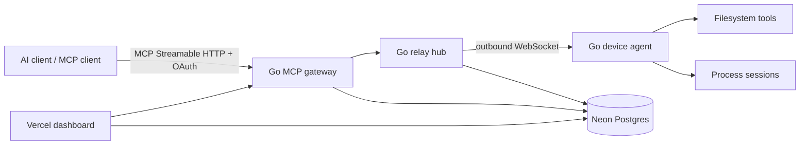

# Open Remote Commander

Open Remote Commander is an open-source remote MCP gateway and device agent written in Go. It lets an MCP-capable AI client invoke filesystem and terminal tools on computers you control without exposing an inbound port on those computers.

> Status: **v0.1 engineering preview**. The relay and device execution path is implemented. Production MCP bearer validation is implemented through standards-based OAuth token introspection; the authorization-server UI/device pairing flow and interactive device dashboard are tracked separately rather than hidden behind demo auth.

## Why this project exists

The useful product shape is simple: an AI client connects to a hosted MCP endpoint; a small foreground agent on your computer opens an outbound connection; calls are routed to that device and executed locally. The cloud service must not become a second shell host or a long-term store of file contents.

## Architecture



The current server uses the official `modelcontextprotocol/go-sdk` and a stateless MCP transport. Device connections are stateful WebSockets; the execution authority remains on the paired machine.

## Implemented MCP tools

- `list_devices`
- `ping`
- `read_file`
- `write_file`
- `list_directory`
- `create_directory`
- `move_file`
- `get_file_info`
- `start_process`
- `read_process_output`
- `interact_with_process`
- `force_terminate`

The filesystem layer canonicalizes paths and resolves symlinks before enforcing allowed roots. Read sizes, relay frame sizes, process buffers, HTTP headers, and process concurrency are bounded.

## Security model

Open Remote Commander is privileged automation, not a sandbox. An authorized AI client can do what the local OS user can do through enabled tools. Allowed roots and future command rules are guardrails; use a VM/container for untrusted workloads.

Cloud-side audit records contain metadata such as tool name, device, status, and duration. Tool arguments and results are not persisted by the application schema. Device secrets are stored as SHA-256 token hashes; plaintext tokens are supplied only to the agent.

See [SECURITY.md](SECURITY.md) and [docs/THREAT_MODEL.md](docs/THREAT_MODEL.md).

## Local development

Requires Go 1.25 or newer.

```bash
cp .env.example .env
# Export the values from .env with your preferred env loader.

go run ./cmd/orc-token  # create an MCP token
go run ./cmd/orc-token  # create a distinct agent token

go run ./cmd/orc-server
# in another terminal
go run ./cmd/orc-agent
```

For a memory-only development run, leave `DATABASE_URL` empty and set the `ORC_BOOTSTRAP_DEVICE_*` values. The bootstrap token must match `ORC_AGENT_TOKEN` and the bootstrap owner must match the authenticated MCP subject.

`ORC_AUTH_MODE=dev` is loopback/development authentication only. For an exposed endpoint use `ORC_AUTH_MODE=introspection` with a standards-compliant authorization server. The verifier requires an active token with `sub`, expiration, the MCP resource in `aud`, and the requested scopes. Protected Resource Metadata then advertises `ORC_AUTH_ISSUER` as required by MCP authorization discovery.

### Neon

Use the pooled Neon URL as `DATABASE_URL` for application traffic. Apply `migrations/001_init.sql` with a direct/unpooled URL. Test migrations on a Neon branch before applying them to production.

### Vercel

`web/` is a static control-plane shell deployable independently on Vercel. The long-lived Go relay remains a normal container/service so WebSocket lifecycle, graceful shutdown, connection ownership, and backpressure are explicit. A Vercel Go adapter can be added for stateless control-plane routes without moving local execution into serverless functions.

## Verification

```bash
make test
make race
make lint
make vuln
make build
```

`make fuzz` fuzzes path resolution and containment. CI runs tests, race detection, vet, govulncheck, and golangci-lint.

## Roadmap

1. Bundled OAuth 2.1 authorization-server profile (external standards-compliant AS works now via introspection).
2. RFC 8628 device authorization pairing with short-lived user codes.
3. Interactive Vercel device dashboard with revoke/rename/session views.
4. Multi-relay connection ownership and dispatch bus for horizontal scaling.
5. Remaining Desktop Commander-compatible search, multi-file, edit, and process inspection tools.
6. Signed desktop installers, auto-update metadata, Windows service and macOS launchd support.
7. Protocol conformance, chaos tests, load tests, and external security review.

See [docs/ARCHITECTURE.md](docs/ARCHITECTURE.md) and [docs/COMPATIBILITY.md](docs/COMPATIBILITY.md).

## License

Apache-2.0. See [LICENSE](LICENSE).
