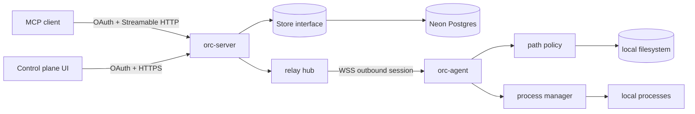

# Architecture

## Component diagram



## Go package topology

```text
cmd/orc-server       composition root for hosted gateway
cmd/orc-agent        composition root for local execution agent
cmd/orc-token        dev-only HMAC token utility
pkg/api/v1           public stable JSON/API types
internal/authn        access-token verification
internal/controlplane pairing/device HTTP handlers
internal/mcpserver    MCP tool registration and dispatch
internal/relay        connection ownership + request/response correlation
internal/protocol     small relay wire format
internal/ws           minimal bounded RFC6455 implementation
internal/store        memory + Neon storage adapters
internal/pathpolicy   symlink-aware allowed-root enforcement
internal/processmgr   bounded local process sessions
internal/executor     typed local tool execution
internal/audit        non-blocking metadata audit writer
internal/config       strict env configuration
```

## Dependency direction

Composition roots depend on internal packages. Business packages do not import `cmd`. `relay` depends on the small `protocol`, `store` and `ws` contracts; execution code never depends on cloud storage or MCP. This prevents the hosted service from quietly accumulating local-execution authority.

Interfaces are introduced at real substitution boundaries (store and token verifier), not for every concrete type. This follows idiomatic Go: accept interfaces where polymorphism is needed, return concrete implementations otherwise.

## Request lifecycle

1. OAuth middleware verifies user access token.
2. MCP handler derives the stable subject from auth context.
3. `store.GetDevice(subject, id)` proves ownership.
4. `relay.Hub.Call` finds the live agent connection and acquires a per-device in-flight slot.
5. Request gets a cryptographically random call ID and is serialized to a bounded frame.
6. Agent unmarshals and validates frame, then `executor.Execute` runs the named local tool.
7. Result travels back over the same socket; relay correlates by call ID.
8. MCP result is returned; audit metadata is queued asynchronously.

## Scaling path

The in-process `Hub` is intentionally simple for v0.1. To scale to multiple relay instances:

- persist only **connection ownership metadata** (`device_id → relay_instance_id`, lease/heartbeat), not tool payloads;
- MCP instance publishes a transient dispatch message to the owner instance;
- owner forwards over its local WebSocket and publishes transient result;
- use short TTLs and idempotent call IDs;
- retain no completed payloads by default.

Redis/NATS are candidates for the transient bus; Neon remains durable identity/audit storage. The bus choice is deferred until a benchmark demonstrates need.
